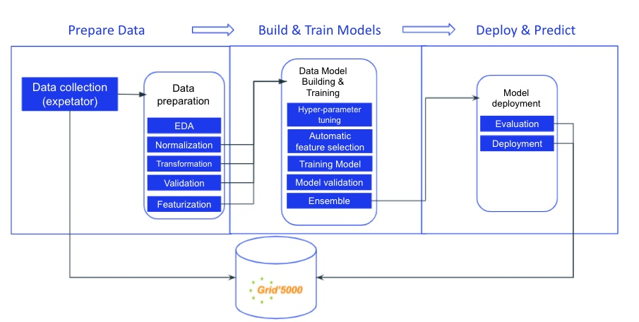

# Power models based on Machine Learning for optimizing HPC systems

Members: Thang NGUYEN DUC, Luis PALLUEL, Landry AMIARD, Pratvi KALAVADIYA

Guided by: Prof. Georges Da COSTA, Prof. Jean-Marc Pierson

Nowadays, the growing computational demand in fields such as Artificial intelligence, Big data, Internet of things etc, is increasing the number of High-performance computation systems. The global energy demand of HPC systems is exponentially growing everyday, and there is an environmental emergency to reduce it. HPC systems are meant to run continuously, but all the nodes composing an HPC platform are not always running at full capacity at all times. Similarly, some nodes are sometimes pushed to their full capacity while the application they are running doesn’t need to. This work is based on the research of M. Pierson and M. Da Costa [1]. The idea of this project is to find innovative ways of optimizing the frequency of such nodes using artificial intelligence and machine learning. The goal is to build a prediction model using real data collected from HPC systems in order to have an efficient way of choosing the amount of resources needed for any application.

The main problem is to find the right frequency that reduces energy cost while keeping efficiency to a maximum. Our application needs to determine which frequency is perfectly suitable for solving the task without producing any waste (not providing high performance for a simple mathematical operation for example). To do so, we based our work on the Dynamic Voltage and Frequency Scaling (DVFS).

The dynamic voltage and frequency scaling
The DVFS technique is commonly used in HPC systems to reduce power consumption, to reduce processors' voltage and frequency when it is not needed and speeding it up when needed. However, it is not easy to come up with such an effective strategy, and the system needs to have an agent that aggregates a lot of environmental parameters to provide the right decision. The parameters (or features) that we choose to collect need to give enough information in order to : If the bottleneck is CPU (the CPU cannot process incoming tasks in time), it needs to increase computation by increasing the CPU frequency. Conversely, if the bottleneck is RAM, we need to reduce the frequency to avoid wasting energy. Increase or decrease frequencies according to sent and received packet speeds over the network or disk, as it also makes an important difference in energy needed.

Machine learning methodologies
The project aims to develop a learning-based model to provide an effective strategy with DVFS for HPC systems' energy management using machine learning methods. Several algorithms can answer this problem : methods based on decision trees, regression, neural networks and so on. Moreover, important work on data should be done. A huge part of any machine learning application success depends on the data understanding and the features engineering. A first part of the project would be to truly understand the data we collect and the features they contain. The choice of the model and the selection of features are the two main axes of the project.

Grid 5000
The project will be experimental on the Grid'5000 system, is a large-scale and flexible testbed for experiment-driven research in all areas of computer science with a large amount of resources: 15000 cores, 800 compute-nodes.

[1] Da Costa, Georges, and Jean-Marc Pierson. "Dvfs governor for hpc: Higher, faster, greener." 2015 23rd Euromicro International Conference on Parallel, Distributed, and Network-Based Processing. IEEE, 2015.

## Contributors
- Authors: Thang NGUYEN DUC, Luis Palluel, Landry Amiard, Pratvi KALAVADIYA.
- Email: duc-thang.nguyen@univ-tlse3.fr, luis.palluel@univ-tlse3.fr, landry.amiard@univ-tlse3.fr, pratvi.kalavadiya@univ-tlse3.fr
- Instructor: Georges Da Costa - dacosta@irit.fr

## Project structure:
```
----defi/
	|---dataset/
	|---docs/
	|---src/
		|---EDA & Visualization/
		|---Modeling & evaluation/
			|--- NN-single-target
			|--- NN-multi-targets
			|--- Tree-based methods
	|---README.md -> this file

```
## Project pipeline

## I. Data collection
we collect data on {nancy, lyon, rennes} sites from [grid5000.fr](https://www.grid5000.fr/w/Grid5000:Home).

### 1. Instruction
1. You need to have an account on grid5000.fr
2. remote ssh to access.grid5000.fr with your username
```
ssh <your username>@access.grid5000.fr
```
3. You can access one site below:
```
ssh {grenoble,luxembourg,lyon,nancy,nantes,rennes,sophia}
```
4. Install libraries: 
```
pip3 install --upgrade expetator
pip3 install --user execo
```
5. Clone [the script to collect data](https://github.com/georges-da-costa/defi/blob/master/defi_phase0_feature_selection.py)
6. Changes the permissions associated with your script:
```
chmod a+rwx defi_phase0_feature_selection.py
```
7. Create a request to run your script:
```
oarsub -p "wattmeter='YES' and cluster in ('**grisou**')" -l /cluster=1/nodes=4,walltime=**05:00:00** defi_phase0_feature_selection.py
``` 
where: walltime is the time you will take up. grisou is an example cluster

**P/S: Read carefully the [Usage Policy](https://www.grid5000.fr/w/Grid5000:UsagePolicy) before use**

8. You can check your reservation status at https://intranet.grid5000.fr/oar/**Nancy**/drawgantt-svg/ . You can see another site by changing Nancy. You should check OAR.-stderr or -stdout to make sure the program runs properly

9. To download your data to your machine. You should zip it firstly
```
zip -r grisou-2-11-20.zip grisou
```
Then, From your machine run below command to download
```
scp <your username>@access.grid5000.fr:nancy/grisou-10-11-20.zip .
```
### 2. Dataset
1. Collected **0.86 GB** on {nancy, lyon} sites [2/11/2020 - Thang]
2. Collected **1 GB** on {nancy, lyon, rennes} sites [10/11/2020 - Thang]

=======

We can download the dataset (zip file:**1.86 GB**) [in here](https://drive.google.com/drive/folders/1m4OxzFCMQ4-zryzz4LVTLkzbY_yB7Rq2?usp=sharing) or We can download [knowledge.csv](https://github.com/georges-da-costa/defi/blob/thangdnsf/src/EDA%20and%20visualization/knowledge.csv) and [vectors.csv](https://github.com/georges-da-costa/defi/blob/thangdnsf/src/EDA%20and%20visualization/vectors.csv) with 18517 rows.

#### Notes
some clusters don't have power data:

- Nancy: gros & graphite
- Lyon: nova

**Solution: remove it from the training dataset**

and some experiments don't have enough or miss the power file. [fixed](https://github.com/georges-da-costa/expetator/blob/thangdnsf/expetator/tools.py)

P/S: we can't compute energy and etp without power data to get the best frequency/ experiment


*updated 10/11/2020 - 22:36 pm*

## II. [Data preparation:](src/EDA%20and%20visualization/read%20all%20new%20dataset%20to%20csv-exp%20on%20fixed%20tool.ipynb)
This part used to process collected dataset to csvs that be used in training and validation ML models.

## III. Exploratory data analysis - EDA: ([Part 1](src/EDA%20and%20visualization/EDA-alldata.ipynb) and [Part 2](src/EDA%20and%20visualization/EDA.ipynb))

### IV. Moeling and evaluation:
1. [Tree-based methods](src/Modeling%20and%20evaluation/Tree-based%20methods)
2. [Sigle target learning in Deep neural network](src/Modeling%20and%20evaluation/NN-single-target)
3. [Multi target learning in Deep neural network](src/Modeling%20and%20evaluation/NN-multi-targets)
The below figure shows a model architecture that be used for Multi target learning.


```
----------------------------------------------------------------
        Layer (type)               Output Shape         Param #
================================================================
       BatchNorm1d-1                  [-1, 190]             380
            Linear-2                 [-1, 1024]         195,584
       BatchNorm1d-3                 [-1, 1024]           2,048
           Dropout-4                 [-1, 1024]               0
            Linear-5                  [-1, 512]         524,800
       BatchNorm1d-6                  [-1, 512]           1,024
           Dropout-7                  [-1, 512]               0
            Linear-8                  [-1, 256]         131,328
       BatchNorm1d-9                  [-1, 256]             512
          Dropout-10                  [-1, 256]               0
           Linear-11                  [-1, 128]          32,896
      BatchNorm1d-12                  [-1, 128]             256
          Dropout-13                  [-1, 128]               0
           Linear-14                   [-1, 64]           8,256
      BatchNorm1d-15                   [-1, 64]             128
          Dropout-16                   [-1, 64]               0
           Linear-17                   [-1, 13]             845
           Linear-18                   [-1, 14]             910
================================================================
Total params: 898,967
Trainable params: 898,967
Non-trainable params: 0
----------------------------------------------------------------
Input size (MB): 0.00
Forward/backward pass size (MB): 0.05
Params size (MB): 3.43
Estimated Total Size (MB): 3.48
----------------------------------------------------------------
```
## V. Results 


### V.1 Tree-based methods: LightGBM on all metrics


### V.2 Multi target learning in Deep neural network

Model performance


The Confusion matrix of target on test dataset.


The Confusion matrix of targetZ on test dataset.


