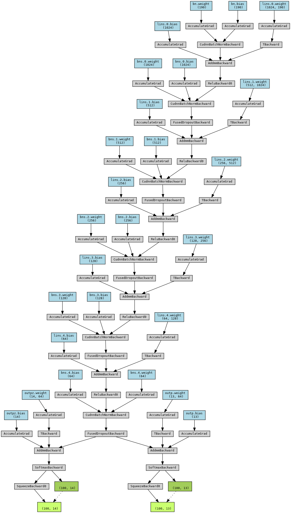
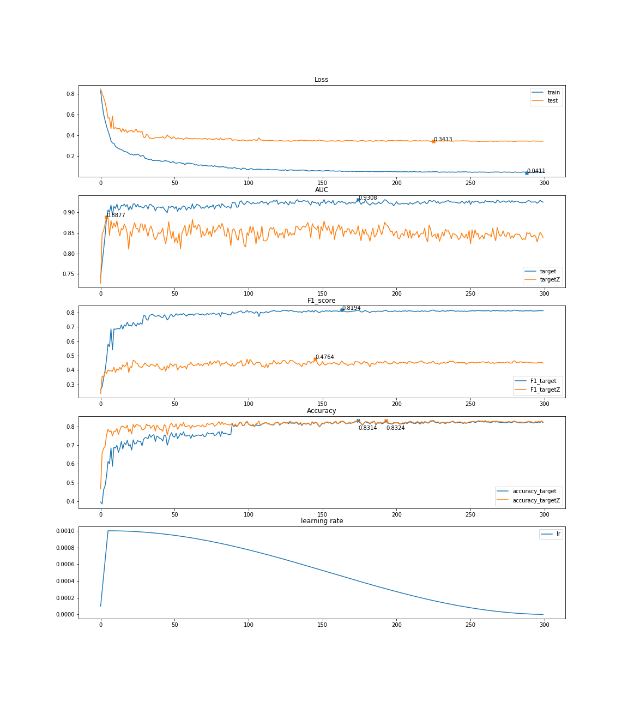
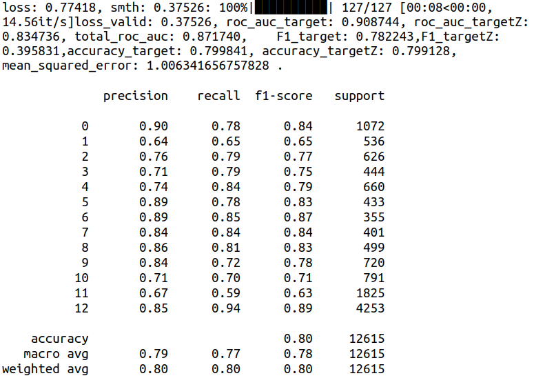
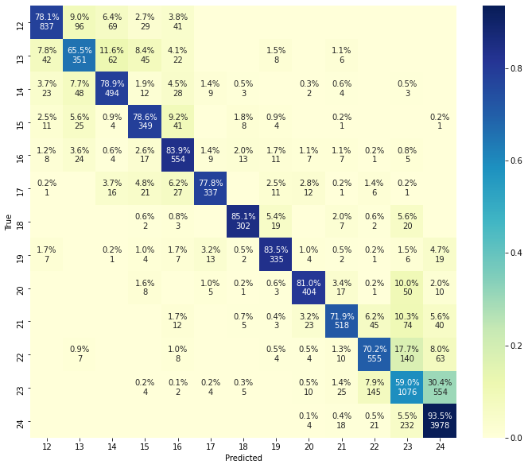
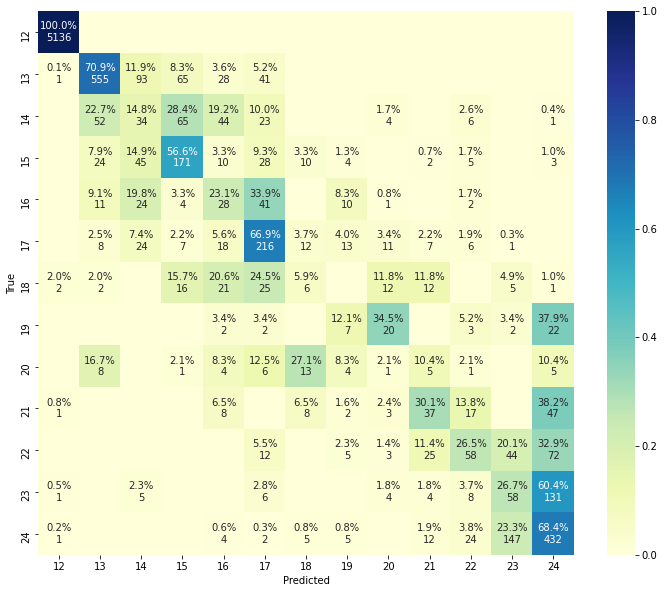

## Project structure:
```
----
    |--- NN-multi-targets
        |--- model.py
        |--- datagenerator.py
        |--- util.py
        |--- datapreparation.py
        |--- training.py
        |--- inference.py
        |--- drawModel.py
        |--- drawlogs.py
        |--- logs/
            |--- _fold<id>_best_accuracy.pth
            |--- _fold<id>_best_AUC.pth
            |--- _fold<id>_best_F1.pth
            |--- _fold<id>_best_loss.pth
            |--- <id>_scaler.pkl
            |--- feature_list.pkl
            |--- log_<dattime>.json
            |--- long_auc_dt.json
            |--- logs.png
        |---README.md -> this file

```

1. **model.py**: Deep neural network definition.
2. **datagenerator.py**: data loader with data standardization and augmentation.
3. **util.py**: Metric, loss function definition
4. **datapreparation.py**: prepare data for training and evalidation. (e.g feature engineering, feature selection, PCA, data splitting (kfold)...)
5. **training.py**: Model training and select the best weight
6. **inference.py**: Using the best weight to evaluate test data or directly real data.

## I. Model architecture


```
----------------------------------------------------------------
        Layer (type)               Output Shape         Param #
================================================================
       BatchNorm1d-1                  [-1, 190]             380
            Linear-2                 [-1, 1024]         195,584
       BatchNorm1d-3                 [-1, 1024]           2,048
           Dropout-4                 [-1, 1024]               0
            Linear-5                  [-1, 512]         524,800
       BatchNorm1d-6                  [-1, 512]           1,024
           Dropout-7                  [-1, 512]               0
            Linear-8                  [-1, 256]         131,328
       BatchNorm1d-9                  [-1, 256]             512
          Dropout-10                  [-1, 256]               0
           Linear-11                  [-1, 128]          32,896
      BatchNorm1d-12                  [-1, 128]             256
          Dropout-13                  [-1, 128]               0
           Linear-14                   [-1, 64]           8,256
      BatchNorm1d-15                   [-1, 64]             128
          Dropout-16                   [-1, 64]               0
           Linear-17                   [-1, 13]             845
           Linear-18                   [-1, 14]             910
================================================================
Total params: 898,967
Trainable params: 898,967
Non-trainable params: 0
----------------------------------------------------------------
Input size (MB): 0.00
Forward/backward pass size (MB): 0.05
Params size (MB): 3.43
Estimated Total Size (MB): 3.48
----------------------------------------------------------------
```
## II. Model performance on fold 1




## III. Confusion matrix on test dataset.
The Confusion matrix of target



The Confusion matrix of targetZ


